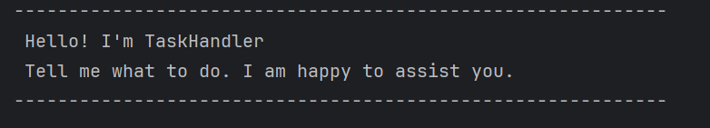
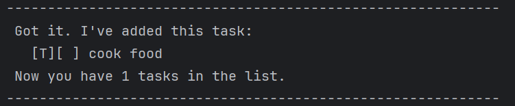
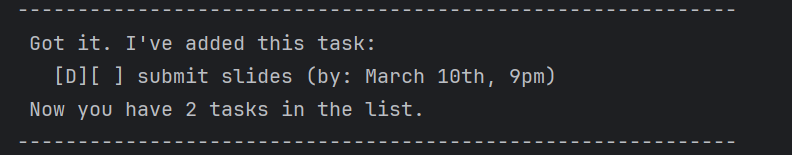
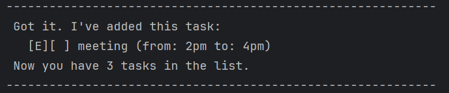
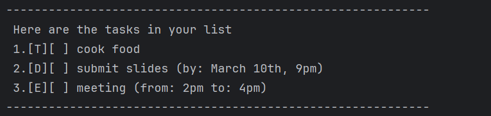
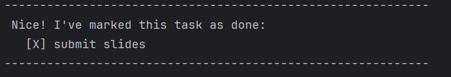
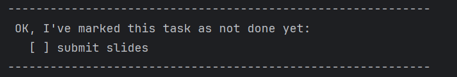
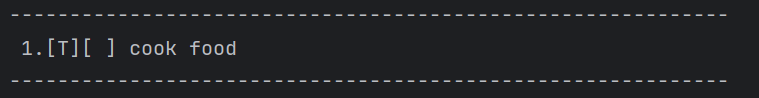
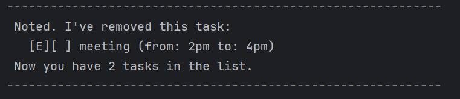
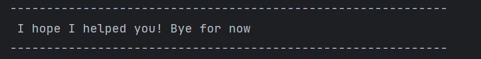

# TaskHandler User Guide

TaskHandler is a Command Line Interface (CLI) based application to help you keep track of different types 
of tasks including to-dos, tracking deadlines or even tasks that fall in a range. Everything is customisable 
to ensure you can rely on this robust application to help you in your daily life. Moreover, all your tasks are
automatically saved to the drive so can be assured that TaskHandler has got you covered!

## Adding a TODO task

Adds a to-do task to the list. These tasks have no time or date constraints.

Format: `todo <description>`

Example: `todo cook food`

The application will display a success message that the task has been added, the task
itself and the new total number of tasks in the list.

## Adding a DEADLINE task

Adds a task that has to be completed before a specific time or date. It requires a description 
and by time/date.

Format: `deadline <description> /by <time/date>`

Example: `deadline submit slides /by March 10th, 9pm`

The application will display a success message that the task has been added, the task
itself and the new total number of tasks in the list.

## Adding an EVENT task

Adds a task that occurs within a specific time frame. It requires a description, from time/date and to time/date.

Format: `event <description> /from <time/date> /to <time/date>`

Example: `todo meeting /from 2pm /to 4pm`

The application will display a success message that the task has been added, the task
itself and the new total number of tasks in the list.

## Displaying all tasks

Displays all the tasks in your list, together with the task's number and completion status.

Format: `list`

Example: `list`

## Mark a task as done

Marks a task in your list as done.

Format: `mark <task number>`

Example: `mark 2`

The application displays a success message that the task has been marked as done and also
displays the task with an [X].

## Unmark a task

Marks a task in your list as not done.

Format: `mark <task number>`

Example: `mark 2`

The application displays a success message that the task has been unmarked as not done and also
displays the task with a [ ]

## Find matching tasks by keyword

Displays the tasks whose description includes your keyword.

Format: `find <keyword>`

Example: `find cook`

The application displays all tasks (along with their task type and completion status) 
whose description contain the keyword 'cook'.

## Delete a task

Deletes a task from your list.

Format: `delete <task number>`

Example: `delete 3`

The application displays the task that has been deleted along with its task type and completion status.
It displays the number of tasks left in the list.

## Exit the application

Saves the current list of tasks to the disk and exits.

Format: `bye`

Example: `bye`

The application displays the farewell message and exits.

